# ⚡ 전기차 충전소 실시간 플랫폼

전국 전기차 충전소 정보와 실시간 충전 상태를 조회하고, 전기차 커뮤니티 정보를 통합 제공하는 Streamlit 기반 플랫폼입니다.

---

## 🛠️ 기술 스택

      

---

# 👥 팀 소개

## 팀명

> # 전기차를 조사했지만 살 생각은 없조

## 👨‍💻 팀원 소개

### 이수연

**GitHub**
https://github.com/lesoo

**담당 업무**

* 전국 충전소 목록 및 상세정보 구현
* 전기차 정보 및 위치 DB Schema 설계

---

### 김일환 / 정현두

**GitHub**

* https://github.com/KangDohwa
* https://github.com/gusen8684

**담당 업무**

* 키워드별 전기차 충전소 검색
* Open API 기반 실시간 충전 상태 구현

---

### 채수환

**GitHub**
https://github.com/suhoo898

**담당 업무**

* 전기차 커뮤니티 크롤링
* 실시간 정보 API 연동 시도
* 전처리 데이터 File I/O 구현

---

### 최지흠

**GitHub**
https://github.com/RabbitTasteDog-PRO

**담당 업무**

* 프로젝트 샘플 구현 및 구조 설계
* 커뮤니티 관련 DB Schema 설계
* UI/UX 단일화
* 프로젝트 관리

---

# 📌 프로젝트 개요

## 프로젝트명

전기차 충전소 실시간 정보 및 커뮤니티 통합 플랫폼

## 📖 프로젝트 소개

전기차 보급이 확대되면서 충전 인프라도 빠르게 증가하고 있지만, 사용자는 충전소 위치와 충전기 상태 등의 정보를 여러 서비스에서 개별적으로 확인해야 하는 불편함이 있다.

본 프로젝트는 공공데이터 Open API와 충전소 운영 데이터를 수집하여 전국 전기차 충전소 정보를 통합 제공하는 Streamlit 기반 플랫폼이다.

사용자는 지역별 충전소를 검색하고 지도에서 위치와 상세 정보를 확인할 수 있으며, 실시간 충전기 상태를 조회하여 현재 사용 가능한 충전기를 빠르게 찾을 수 있다.

또한 전기차 커뮤니티의 전기차 관련 게시글을 키워드로 수집·검색하는 기능도 제공한다. 이를 통해 충전소 정보뿐만 아니라 실제 전기차 사용자의 경험과 FAQ 후보 정보까지 하나의 서비스에서 확인할 수 있도록 구현하였다.

수집한 데이터는 MySQL 데이터베이스에서 통합 관리하며, 단일 Streamlit 애플리케이션에서 각 기능을 사용할 수 있도록 구성하였다.

---

## 🎯 프로젝트 필요성

전기차 등록 대수는 지속적으로 증가하고 있으나 충전 인프라를 이용하는 과정에는 다음과 같은 불편함이 있다.

* 원하는 지역의 충전소 위치를 한눈에 파악하기 어렵다.
* 충전소 방문 전에 충전기의 실시간 사용 가능 여부를 확인하기 어렵다.
* 충전기 유형과 운영 상태를 지역별로 비교하기 어렵다.
* 충전소에 도착한 후 충전기가 사용 중이거나 고장 상태인 경우가 발생한다.
* 전기차 관련 사용자 경험과 정보를 얻으려면 여러 커뮤니티를 직접 검색해야 한다.
* 충전소 정보와 커뮤니티 정보가 서로 다른 서비스에 분산되어 있다.

이에 따라 공공데이터와 실시간 API, 커뮤니티 크롤링 데이터를 하나의 데이터베이스와 화면에 통합하여 사용자의 정보 탐색 과정을 줄이고 충전소 이용 편의성을 높이는 서비스를 기획하였다.

---

## 🚀 프로젝트 목표

### 1. 지역별 충전소 정보 통합 제공

* 전국 전기차 충전소 위치 조회
* 시·도 및 시·군·구 기반 지역 검색
* 충전소 주소와 위치 등 상세 정보 제공
* 지도 기반 충전소 위치 시각화
* 선택 지역의 충전소 목록 제공

### 2. 실시간 충전 상태 제공

* 공공데이터 Open API 기반 충전기 상태 수집
* 현재 사용 가능한 충전기 조회
* 충전 대기, 충전 중, 점검 및 상태 미확인 구분
* 충전소 및 충전기별 상태 정보 제공
* 실시간 데이터 갱신 시각 확인

### 3. 데이터 기반 정보 제공

* 지역별 충전소 및 충전기 현황 분석
* 충전기 상태별 수량과 비율 시각화
* 충전 용량과 유형별 현황 제공
* 지역별 충전 인프라 비교
* MySQL 기반 수집 데이터 통합 관리

### 4. 커뮤니티 정보 통합 검색

* EVDang, EV 라운지, 뽐뿌 자동차포럼 게시글 수집
* 전기차 및 차종 관련 키워드 검색
* 게시글 제목, 작성일 및 원문 링크 제공
* 최신 게시글 우선 조회
* 사용자 경험과 FAQ 후보 정보의 접근성 향상

### 5. 통합 서비스 구현

* 충전소 조회, 실시간 상태 확인, 커뮤니티 검색 기능 통합
* 단일 Streamlit 애플리케이션으로 화면 구성
* 공통 MySQL 데이터베이스 기반 데이터 관리
* 사용자가 필요한 정보를 직관적으로 확인할 수 있는 UI 제공

---

# 📊 데이터 수집 방법

## 수집한 CSV 파일

### 충전소 및 지역 데이터

| 파일 | 내용 |
| --- | --- |
| [`data/raw/station_charger_raw_data.csv`](data/raw/station_charger_raw_data.csv) | 충전소 및 충전기 상세 정보 |
| [`data/raw/map_station_region_cd.csv`](data/raw/map_station_region_cd.csv) | 충전소와 지역 코드 매핑 정보 |
| [`data/raw/tbl_region_cd.csv`](data/raw/tbl_region_cd.csv) | 지역 코드, 지역명 및 행정구역 계층 정보 |
| [`data/raw/coord_by_region.csv`](data/raw/coord_by_region.csv) | 지역별 위도·경도 정보 |
| [`data/raw/elec_usage_by_region.csv`](data/raw/elec_usage_by_region.csv) | 지역별 전기차 충전기 현황 |
| [`resources/한국환경공단_전기차 충전소 위치 및 운영정보_20221027.csv`](resources/한국환경공단_전기차%20충전소%20위치%20및%20운영정보_20221027.csv) | 한국환경공단 충전소 위치 및 운영 원본 데이터 |

### 커뮤니티 크롤링 데이터

| 파일 | 내용 |
| --- | --- |
| [`data/ev_user_questions.csv`](data/ev_user_questions.csv) | 전기차 커뮤니티 게시글 통합 수집 데이터 |
| [`data/ev_user_questions_EVDang_테슬라.csv`](data/ev_user_questions_EVDang_테슬라.csv) | EVDang의 테슬라 관련 게시글 |
| [`data/ev_user_questions_EV_라운지_충전.csv`](data/ev_user_questions_EV_라운지_충전.csv) | EV 라운지의 충전 관련 게시글 |
| [`data/ev_user_questions_EV_라운지_테슬라.csv`](data/ev_user_questions_EV_라운지_테슬라.csv) | EV 라운지의 테슬라 관련 게시글 |
| [`data/ev_user_questions_뽐뿌_자동차포럼_충전.csv`](data/ev_user_questions_뽐뿌_자동차포럼_충전.csv) | 뽐뿌 자동차포럼의 충전 관련 게시글 |
| [`data/ev_user_questions_뽐뿌_자동차포럼_테슬라.csv`](data/ev_user_questions_뽐뿌_자동차포럼_테슬라.csv) | 뽐뿌 자동차포럼의 테슬라 관련 게시글 |

### 기능별 사용 데이터

| 파일 | 내용 |
| --- | --- |
| [`locale_status/Data/coords.csv`](locale_status/Data/coords.csv) | 지역별 충전 현황 기능에서 사용하는 좌표 데이터 |
| [`locale_status/Data/test_data.csv`](locale_status/Data/test_data.csv) | 지역별 충전 현황 기능에서 사용하는 충전기 통계 데이터 |
| [`faq_crawling/Data/coords.csv`](faq_crawling/Data/coords.csv) | FAQ 크롤링 기능에서 사용하는 좌표 데이터 |
| [`faq_crawling/Data/test_data.csv`](faq_crawling/Data/test_data.csv) | FAQ 크롤링 기능에서 사용하는 충전기 통계 데이터 |

## 공공데이터포털

https://www.data.go.kr

* 전국 전기차 충전소 정보 제공
* Open API 활용

## 한국전력공사 전기차 충전소 설치현황 API

https://bigdata.kepco.co.kr

* 충전소 설치 현황 제공
* Open API 활용

## 한국전력공사 지역별 전기차 충전기 현황

https://www.data.go.kr/data/15039555/fileData.do

* 지역별 충전기 통계 데이터
* CSV 파일 활용

## 전기차 커뮤니티 크롤링

### 수집 대상

* https://evdang.com
* https://www.evpost.co.kr
* https://www.ppomppu.co.kr

### 수집 정보

* 게시글 제목
* 게시글 링크
* 커뮤니티 출처

---

# 🗄️ DB 설계

## 논리 ERD

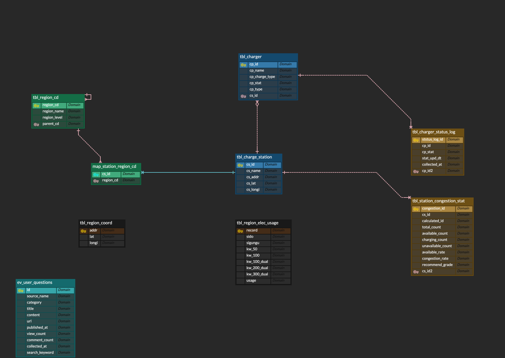

## 물리 ERD

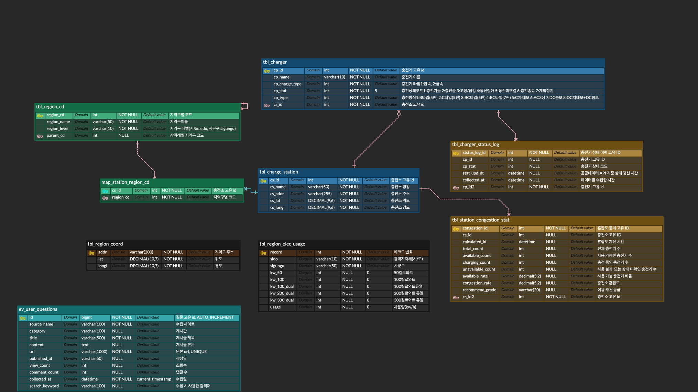

---

# 🚀 주요 기능

## 🚗 지역별 충전소 조회

### 기능 설명

* 선택한 지역의 충전소 목록 조회
* 지도 기반 충전소 위치 표시
* 충전소별 상세 정보 제공

### 제공 정보

* 충전소명
* 주소
* 충전기 종류
* 충전기 수량
* 운영 기관 정보

---

## 🔋 실시간 사용 가능 충전기 조회

### 기능 설명

* Open API 기반 실시간 충전기 상태 조회
* 사용 가능한 충전기 목록 제공
* 충전 상태 시각화

### 제공 상태

* 사용 가능
* 충전 중
* 고장
* 점검 중

---

## 🌐 전기차 커뮤니티 검색

### 기능 설명

제조사 FAQ보다 실제 사용자 경험이 담긴 커뮤니티 정보가 더 유용하다고 판단하여 전기차 관련 커뮤니티 검색 기능을 구현하였다.

### 수집 대상

* EVDang
* EV라운지
* 뽐뿌

### 제공 정보

* 게시글 제목
* 게시글 링크
* 커뮤니티 출처

---

# ⚙️ 실행 방법

```bash
git clone {repository-url}

cd {repository-name}

python -m venv .venv

# Mac / Linux
source .venv/bin/activate

# Windows
.venv\Scripts\activate

pip install -r requirements.txt

streamlit run app.py
```

---

# 🖥️ 수행 화면

## 메인 화면

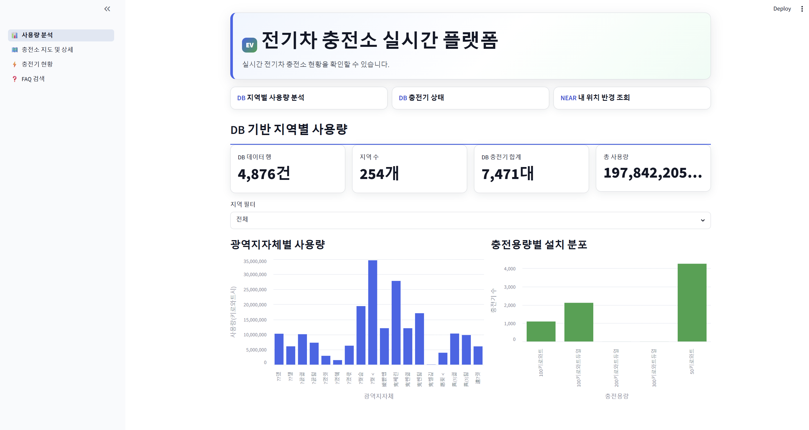

## 충전소 조회 화면

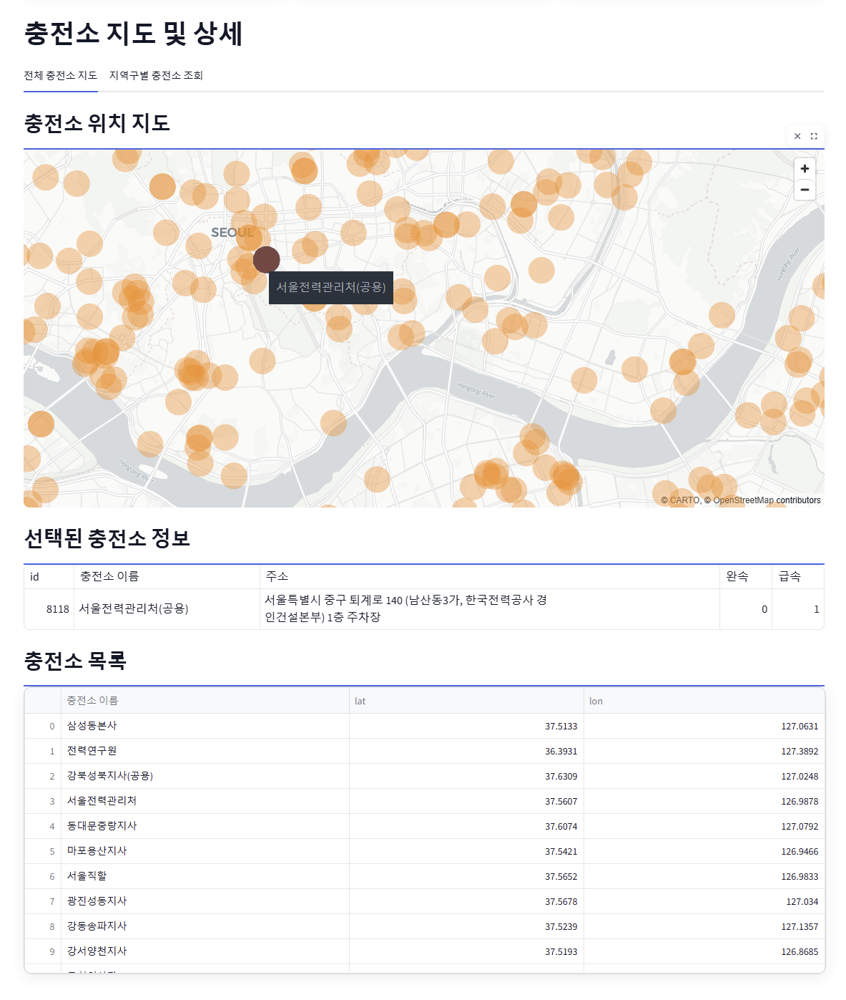
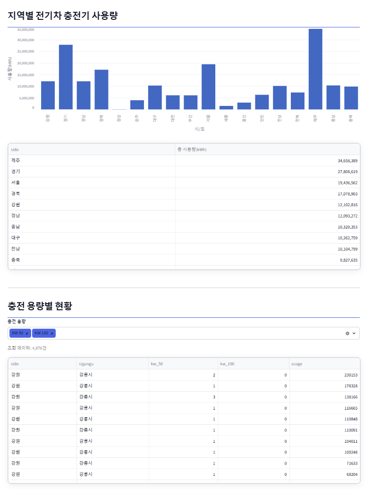

## 실시간 충전기 조회 화면

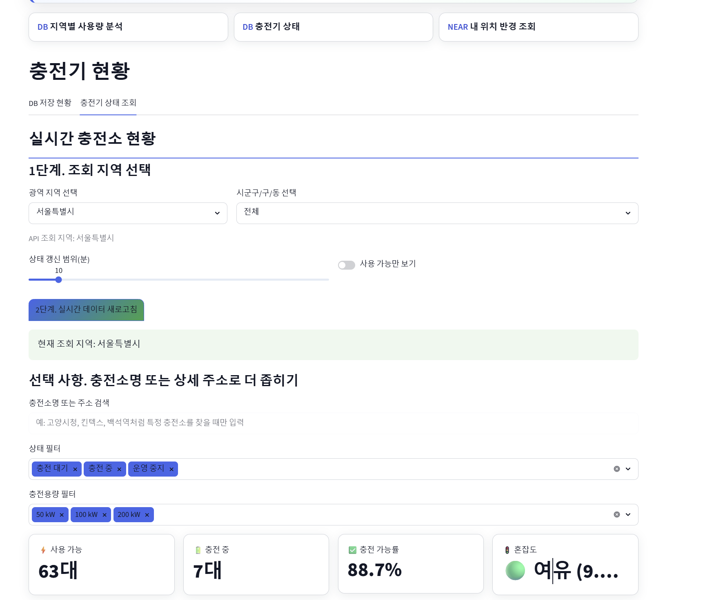
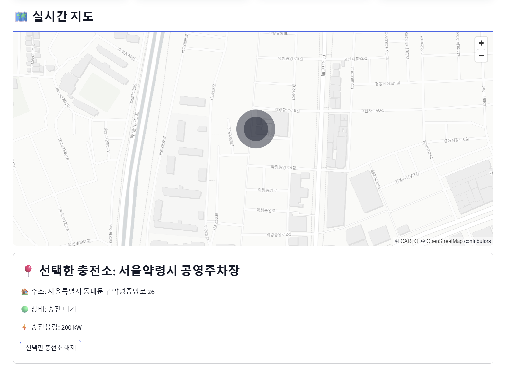
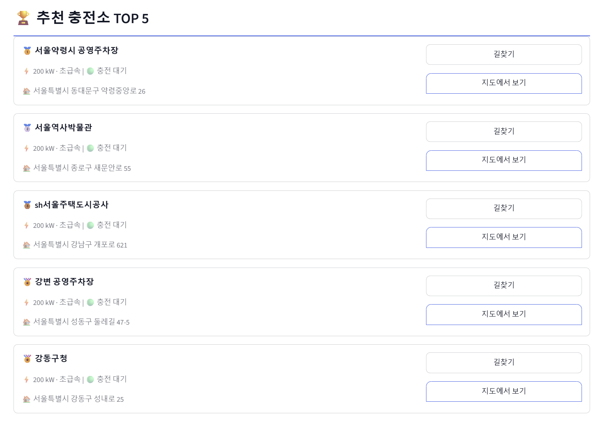
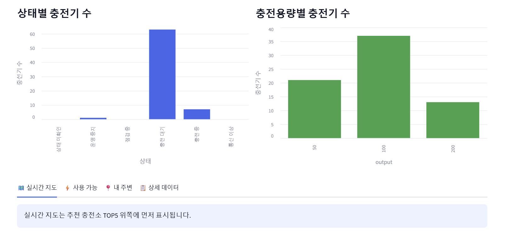
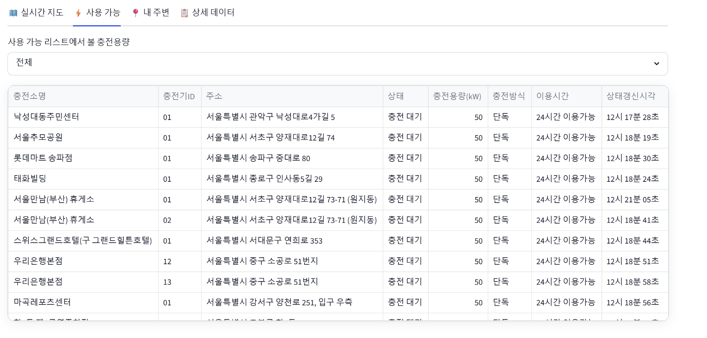

## 커뮤니티 검색 화면

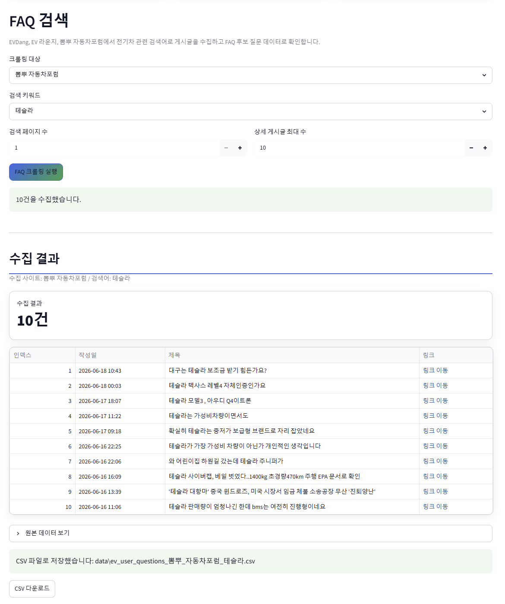
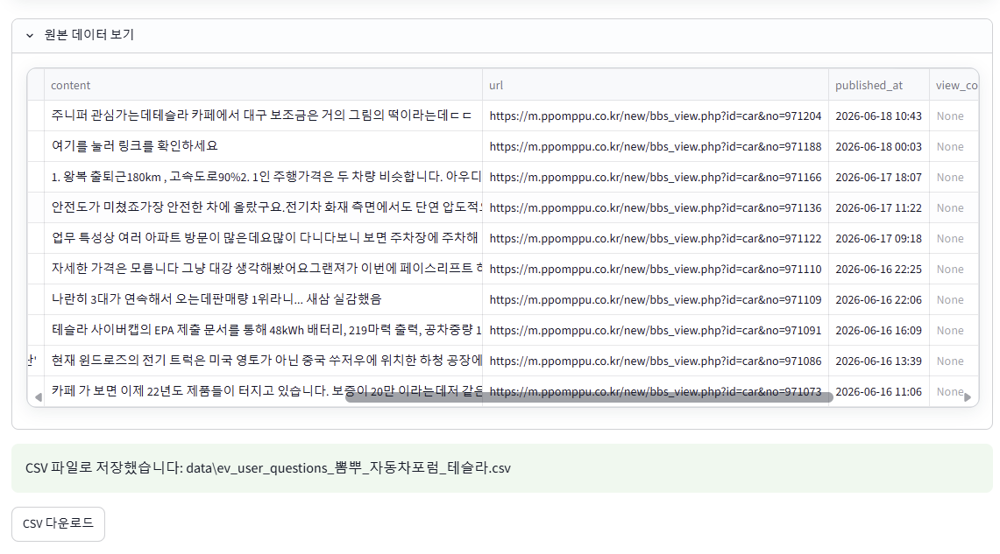


---

# 📝 회고

## 👍 잘된 점

* 공공데이터 Open API 활용 경험 확보
* Streamlit 기반 데이터 시각화 구현
* 크롤링, API, DB를 하나의 프로젝트로 통합

## 🤔 아쉬운 점

* 일부 API의 실시간 데이터 활용 한계
* 충전기 상태 데이터 정확도 이슈
* 제한된 기간 내 구현 범위 조정 필요

## 🔥 향후 개선 방향

* 충전소 추천 기능 추가
* 충전소 혼잡도 분석 기능 추가
* 사용자 위치 기반 주변 충전소 추천
* 충전소 이용 후기 및 평점 기능 추가
* 전기차 화재 및 FAQ 데이터 연계 기능 추가
