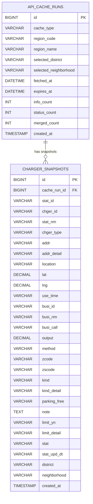

# EV Charger Dashboard ERD
## 현재 사용 가능한 충전기 찾기:위치이동가능

## 테이블 설명

| 테이블 | 설명 |
| --- | --- |
| `api_cache_runs` | API 데이터를 조회하고 캐시한 실행 단위 정보를 저장합니다. 지역, 조회 시각, 만료 시각, 수집 건수를 관리합니다. |
| `charger_snapshots` | 특정 캐시 실행 시점에 수집된 충전기별 상세 스냅샷을 저장합니다. 충전소 기본 정보, 위치, 사업자, 출력, 상태 정보를 포함합니다. |

## 관계

| 관계 | 설명 |
| --- | --- |
| `api_cache_runs.id` -> `charger_snapshots.cache_run_id` | 하나의 API 캐시 실행 결과는 여러 충전기 스냅샷을 가질 수 있습니다. |

## 주요 제약 조건

| 테이블 | 제약 조건 | 설명 |
| --- | --- | --- |
| `api_cache_runs` | `PRIMARY KEY (id)` | 캐시 실행 단위 고유 ID |
| `charger_snapshots` | `PRIMARY KEY (id)` | 충전기 스냅샷 고유 ID |
| `charger_snapshots` | `FOREIGN KEY (cache_run_id) REFERENCES api_cache_runs(id) ON DELETE CASCADE` | 캐시 실행이 삭제되면 연결된 스냅샷도 함께 삭제 |
| `charger_snapshots` | `UNIQUE KEY (cache_run_id, stat_id, chger_id)` | 같은 캐시 실행 안에서 동일 충전기 중복 저장 방지 |

## 인덱스

| 테이블 | 인덱스 | 컬럼 |
| --- | --- | --- |
| `api_cache_runs` | `idx_api_cache_runs_lookup` | `cache_type`, `region_code`, `expires_at` |
| `api_cache_runs` | `idx_api_cache_runs_selection` | `cache_type`, `region_code`, `selected_district`, `selected_neighborhood` |
| `api_cache_runs` | `idx_api_cache_runs_fetched_at` | `fetched_at` |
| `charger_snapshots` | `idx_charger_snapshots_location` | `zcode`, `district`, `neighborhood` |
| `charger_snapshots` | `idx_charger_snapshots_status` | `stat` |
| `charger_snapshots` | `idx_charger_snapshots_station` | `stat_id` |
| `charger_snapshots` | `idx_charger_snapshots_output` | `output` |
